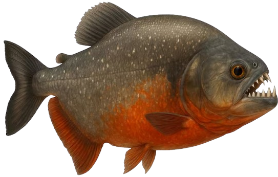

# The Migratory Path 🐠

A fast-paced underwater survival game built with Go and Ebiten. Guide a school of fish through treacherous kelp forests, collect golden coins, and see how long you can survive as the current speeds up!



## 📖 About

Navigate your school of fish through an endless underwater obstacle course. As the leader, you must guide your followers safely through gaps in the kelp while collecting coins. But beware—the ocean current grows stronger over time, making survival increasingly challenging!

## ✨ Features

### Core Gameplay
- **Dynamic School System**: Control a leader fish while 14 followers swim behind you in formation
- **Progressive Difficulty**: Water current speed increases over time, reaching up to 3x the starting speed
- **Obstacle Navigation**: Weave through randomly generated kelp obstacles with varying gap sizes
- **Collectible Coins**: Gather golden coins scattered throughout the kelp for points

### Visual Polish
- **Living Environment**: 
  - 8 background fish swimming at various depths with transparency effects
  - 15 animated bubbles floating upward with natural wobble
  - Waving kelp that sways with the current
- **Dynamic Fish Movement**: Each follower fish wanders independently within their formation
- **Particle Effects**: Shiny circular coins with highlights and depth
- **Professional UI**: Large, readable stats display showing Score, Coins, and Speed multiplier

### Game Mechanics
- **Precise Collision**: Circle-based collision detection for accurate hit detection
- **Formation Following**: Smooth delayed following behavior creates natural schooling
- **Restart System**: Type "anay" after game over to restart

## 🎮 Controls

- **W / Up Arrow**: Move up
- **S / Down Arrow**: Move down
- **Enter**: Submit restart code (after game over)
- **Backspace**: Delete characters in restart input

## 🚀 Installation

### Prerequisites
- Go 1.24.0 or higher
- Working C compiler (for Ebiten's native dependencies)

### Setup

1. Clone the repository:
```bash
git clone https://github.com/RobertGarabetian/scope_f25_project.git
cd scope_f25_project
```

2. Install dependencies:
```bash
go mod download
```

3. Build the game:
```bash
go build
```

4. Run the game:
```bash
./game
```

Or run directly without building:
```bash
go run .
```

## 📁 Project Structure

```
scope_f25_project/
├── assets/
│   └── fish.png           # Fish sprite
├── main.go                # Entry point
├── game.go                # Game logic and update loop
├── entities.go            # Game structs (Fish, Obstacle, Coin, etc.)
├── constants.go           # Game configuration constants
├── sprites.go             # Drawing functions
├── collision.go           # Collision detection
├── go.mod                 # Go module dependencies
└── README.md              # This file
```

## 🎯 Game Mechanics

### Scoring System
- **+1 point** for each obstacle pair successfully passed
- Coins collected are tracked separately

### Difficulty Progression
- Speed increases by 0.05x every 10 seconds
- Maximum speed: 3.0x (reached after ~4 minutes)
- Gap size remains constant at 400 pixels

### Fish School Behavior
- Leader fish: Directly controlled by player
- Follower fish: Follow the leader with smooth interpolation
- Each follower wanders randomly within a 40-pixel radius
- Wander intervals vary between 1-3 seconds per fish
- All fish in the school can collide with obstacles

### Background Elements
- **Background Fish**: Swim horizontally at various depths (0.3-0.7 opacity)
- **Bubbles**: Rise upward with sine-wave wobble, wrapping from bottom
- **Kelp**: Waves with time-based animation, amplitude increases toward top

## 🛠️ Technical Details

### Built With
- **Language**: Go 1.24.0
- **Game Engine**: [Ebiten](https://ebiten.org/) v2.9.4
- **Font**: Bitmap font from ebiten/bitmapfont

### Performance
- Target: 60 FPS
- Resolution: 1280x720
- Collision: Optimized circle-rectangle intersection tests

### Key Algorithms
- **Fish Movement**: Smooth interpolation with distance-based speed
- **Obstacle Generation**: Procedural generation with configurable gaps
- **Wave Animation**: Sine-based motion with position and time offsets
- **Bubble Physics**: Vertical movement with horizontal wobble

## 🎨 Customization

You can easily modify game parameters in `constants.go`:

```go
const (
    NumFish          = 14    // Number of follower fish
    FishSize         = 48    // Size of follower fish
    PlayerSpeed      = 5.0   // Vertical movement speed
    ScrollSpeed      = 3.0   // Base scroll speed
    ObstacleMinGap   = 400   // Gap size in obstacles
    NumBackgroundFish = 8    // Ambient fish count
    NumBubbles        = 15   // Bubble count
    // ... and more
)
```

## 🎓 Learning Outcomes

This project demonstrates:
- Game loop architecture in Go
- 2D rendering with Ebiten
- Collision detection systems
- Particle systems and animations
- State management in games
- Procedural content generation
- Smooth interpolation and following behavior

## 🤝 Contributing

This is a student project, but suggestions and improvements are welcome! Feel free to fork and experiment.

## 📝 License

This project is part of the Fall 2025 coursework.

## 🙏 Acknowledgments

- Built with [Ebiten](https://ebiten.org/) - A dead simple 2D game library for Go
- Inspired by classic endless runner games
- Fish sprite and visual design created for this project

---

**Enjoy the game!** 🐟💙 Try to beat your high score and see how fast you can survive!
